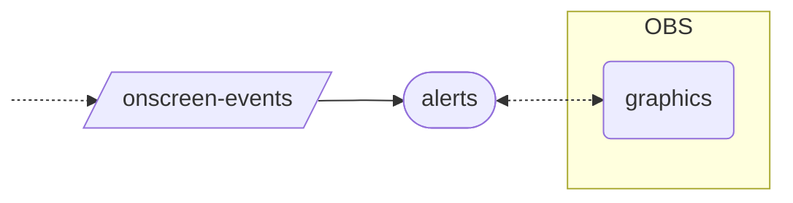

# schemas

The **schemas** codebase defines common data structures used across the backend, mainly
in RabbitMQ message queues that facilitate asynchronous, decoupled interop between
services.

This document outlines how those queues, with their corresponding event schemas, fit
into the architecture of the Golden VCR backend.

## twitch-events

The **twitch-events** schema describes events that are produced to a queue of the same
name. These events are produced in response to external events that occur on Twitch, by
way of two different sources:

- Webhook callbacks initiated by Twitch in response to events that match
  [EventSub][twitch-docs-eventsub] subscriptions. The [**hooks**][gh-hooks] service is
  responsible for configuring those subscriptions, and it handles EventSub webhook calls
  by producing the appropriate events to the **twitch-events** queue.

- User messages and other IRC events that occur in [Twitch chat][twitch-docs-irc]. The
  [**chatbot**][gh-chatbot] service stays logged in to Twitch chat and produces to the
  **twitch-events** queue whenever a user action should result in some effect taking
  place on the backend.

This diagram describes how events make their way onto the **twitch-events** queue:

For some viewer interactions, we credit Golden VCR Fun points to the user's balance via
the [**ledger**][gh-ledger] service, then we initiate another action elsewhere in the
backend that uses some or all of those points. These two effects need to occur
synchronously: we have to ensure that points have been granted before we proceed to use
them.

Therefore, we position the [**dispatch**][gh-dispatch] service between the **twitch-events**
queue and any downstream events that initiate actions that may require points: the
dispatch service's consumer process ensures that points are successfully credited before
any further actions take place.

When the [**dispatch**][gh-dispatch] consumer encounters a Twitch event that requires
crediting points to a user, it will:

1. Contact the [**auth**][gh-auth] service via `POST /service-token` to obtain a JWT
   which authorizes the backend to update that user's balance of fun points.

2. Make a request to the [**ledger**][gh-ledger] server at one of its `POST /inflow/*`
   endpoints, supplying that JWT for authorization, in order to credit the desired
   number of points to the user.

3. Produce events to other queues so that downstream services can respond to those
   events with a reasonable guarantee that the required points are available.

## onscreen-events

The **onscreen-events** schema describes events that are produced to a queue of the same
name, indicating that something should happen onscreen, within the stream. These events
are consumed within the [**alerts**][gh-alerts] service, which queues alerts for display
and serves them over HTTP to the [**graphics**][gh-graphics] frontend app which runs
within OBS.

## generation-requests

Some alerts require the backend to perform additional work in the background before
anything can be shown on-stream: for example, if a user cheers to request a ghost image,
we need to generate an image from their request before it can be displayed onscreen as
an alert. For these requests, [**dispatch**][gh-dispatch] produces an event to the
**generation-requests** queue, where it's handled by a service like
[**dynamo**][gh-dynamo], which ultimately instigates the onscreen alert event.

## broadcast-events

Each time we go live on Twitch, we establish a new **broadcast** in the Golden VCR
backend. While that broadcast is ongoing, we can choose a tape to begin a **screening**
of that tape within the broadcast. These changes in overall state are represented by
messages that conform to the **broadcast-events** schema, which are published to a queue
of the same name by the [**broadcasts**][gh-broadcasts] service.

Services that need to be aware of the current broadcast state (i.e. whether the stream
is live and which tape is being screened) can consume events from **broadcast-events**
in order to be notified when that state changes.

[twitch-docs-eventsub]: https://dev.twitch.tv/docs/eventsub/
[twitch-docs-irc]: https://dev.twitch.tv/docs/irc/
[gh-hooks]: https://github.com/golden-vcr/hooks
[gh-chatbot]: https://github.com/golden-vcr/chatbot
[gh-ledger]: https://github.com/golden-vcr/ledger
[gh-dispatch]: https://github.com/golden-vcr/dispatch
[gh-auth]: https://github.com/golden-vcr/auth
[gh-alerts]: https://github.com/golden-vcr/alerts
[gh-graphics]: https://github.com/golden-vcr/graphics
[gh-dynamo]: https://github.com/golden-vcr/dynamo
[gh-broadcasts]: https://github.com/golden-vcr/broadcasts
